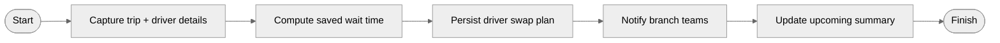

```mermaid
%%{init: {'theme': 'neutral'}}%%
flowchart LR
  Start([Start]) --> Capture[Capture trip + driver details]
  Capture --> Compute[Compute saved wait time]
  Compute --> Persist[Persist driver swap plan]
  Persist --> Notify[Notify branch teams]
  Notify --> UpdateSummary[Update upcoming summary]
  UpdateSummary --> End([Finish])
```
