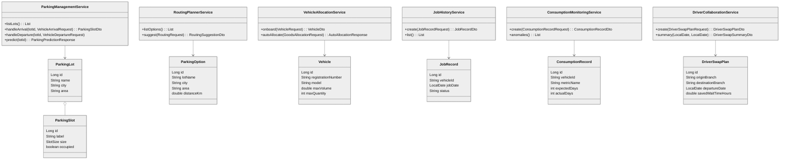

```mermaid
%%{init: {'theme': 'neutral'}}%%
classDiagram
  class ParkingManagementService {
    +listLots(): List<ParkingLotDto>
    +handleArrival(lotId, VehicleArrivalRequest): ParkingSlotDto
    +handleDeparture(lotId, VehicleDepartureRequest)
    +predict(lotId): ParkingPredictionResponse
  }
  class ParkingLot {
    Long id
    String name
    String city
    String area
  }
  class ParkingSlot {
    Long id
    String label
    SlotSize size
    boolean occupied
  }
  ParkingManagementService --> ParkingLot
  ParkingLot o-- ParkingSlot

  class RoutingPlannerService {
    +listOptions(): List<RoutingSuggestionDto>
    +suggest(RoutingRequest): RoutingSuggestionDto
  }
  class ParkingOption {
    Long id
    String lotName
    String city
    String area
    double distanceKm
  }
  RoutingPlannerService --> ParkingOption

  class VehicleAllocationService {
    +onboard(VehicleRequest): VehicleDto
    +autoAllocate(GoodsAllocationRequest): AutoAllocationResponse
  }
  class Vehicle {
    Long id
    String registrationNumber
    String model
    double maxVolume
    int maxQuantity
  }
  VehicleAllocationService --> Vehicle

  class JobHistoryService {
    +create(JobRecordRequest): JobRecordDto
    +list(): List<JobRecordDto>
  }
  class JobRecord {
    Long id
    String vehicleId
    LocalDate jobDate
    String status
  }
  JobHistoryService --> JobRecord

  class ConsumptionMonitoringService {
    +create(ConsumptionRecordRequest): ConsumptionRecordDto
    +anomalies(): List<ConsumptionAnomalyDto>
  }
  class ConsumptionRecord {
    Long id
    String vehicleId
    String metricName
    int expectedDays
    int actualDays
  }
  ConsumptionMonitoringService --> ConsumptionRecord

  class DriverCollaborationService {
    +create(DriverSwapPlanRequest): DriverSwapPlanDto
    +summary(LocalDate, LocalDate): DriverSwapSummaryDto
  }
  class DriverSwapPlan {
    Long id
    String originBranch
    String destinationBranch
    LocalDate departureDate
    double savedWaitTimeHours
  }
  DriverCollaborationService --> DriverSwapPlan
```
