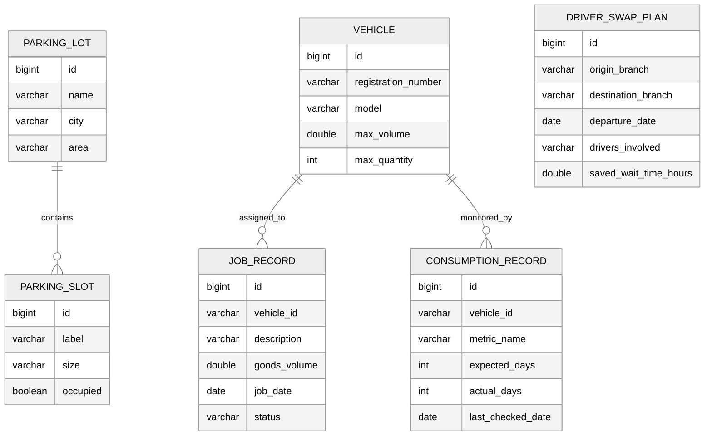

```mermaid
%%{init: {'theme': 'neutral'}}%%
erDiagram
  PARKING_LOT ||--o{ PARKING_SLOT : contains
  PARKING_LOT {
    bigint id
    varchar name
    varchar city
    varchar area
  }
  PARKING_SLOT {
    bigint id
    varchar label
    varchar size
    boolean occupied
  }

  VEHICLE ||--o{ JOB_RECORD : assigned_to
  VEHICLE ||--o{ CONSUMPTION_RECORD : monitored_by
  VEHICLE {
    bigint id
    varchar registration_number
    varchar model
    double max_volume
    int max_quantity
  }
  JOB_RECORD {
    bigint id
    varchar vehicle_id
    varchar description
    double goods_volume
    date job_date
    varchar status
  }
  CONSUMPTION_RECORD {
    bigint id
    varchar vehicle_id
    varchar metric_name
    int expected_days
    int actual_days
    date last_checked_date
  }

  DRIVER_SWAP_PLAN {
    bigint id
    varchar origin_branch
    varchar destination_branch
    date departure_date
    varchar drivers_involved
    double saved_wait_time_hours
  }
```
