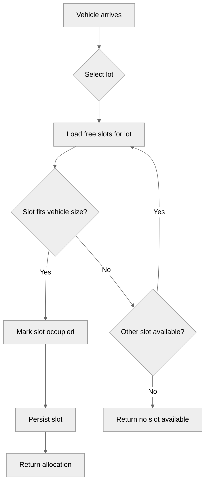
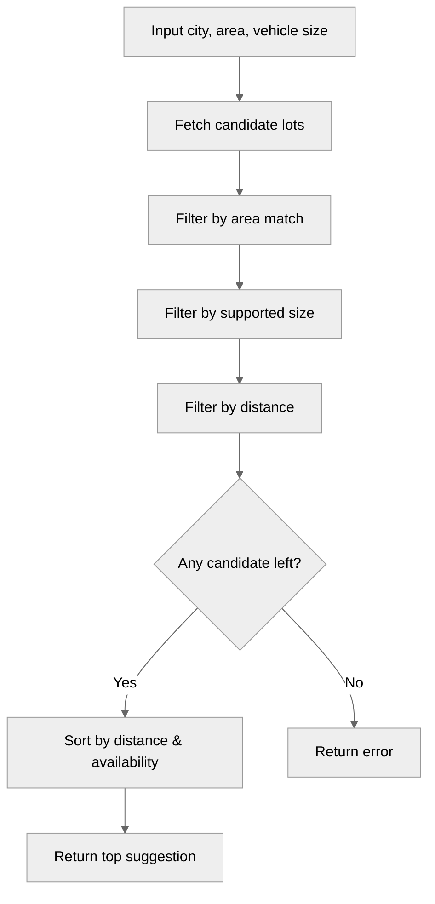
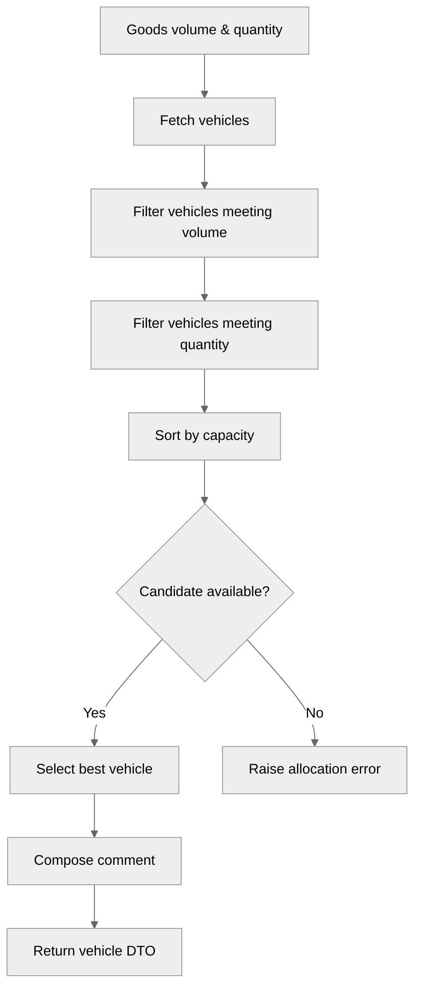
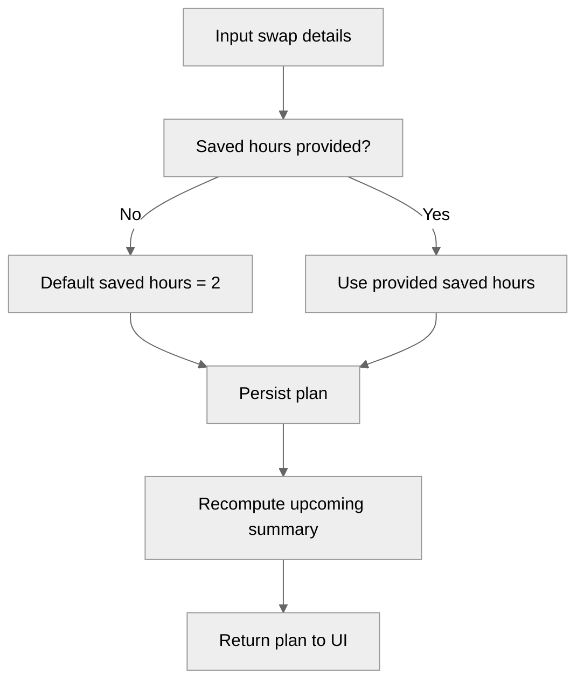
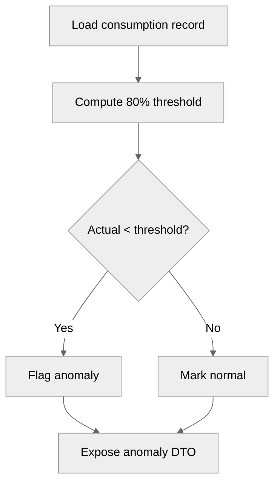

# Flowcharts

## Parking Arrival Allocation

```mermaid
%%{init: {'theme': 'neutral'}}%%
flowchart TD
  A[Vehicle arrives] --> B{Select lot}
  B --> C[Load free slots for lot]
  C --> D{Slot fits vehicle size?}
  D -- Yes --> E[Mark slot occupied]
  E --> F[Persist slot]
  F --> G[Return allocation]
  D -- No --> H{Other slot available?}
  H -- Yes --> C
  H -- No --> I[Return no slot available]
```

## Routing Recommendation

```mermaid
%%{init: {'theme': 'neutral'}}%%
flowchart TD
  R1[Input city, area, vehicle size] --> R2[Fetch candidate lots]
  R2 --> R3[Filter by area match]
  R3 --> R4[Filter by supported size]
  R4 --> R5[Filter by distance]
  R5 --> R6{Any candidate left?}
  R6 -- Yes --> R7[Sort by distance & availability]
  R7 --> R8[Return top suggestion]
  R6 -- No --> R9[Return error]
```

## Auto-allotment

```mermaid
%%{init: {'theme': 'neutral'}}%%
flowchart TD
  A1[Goods volume & quantity] --> A2[Fetch vehicles]
  A2 --> A3[Filter vehicles meeting volume]
  A3 --> A4[Filter vehicles meeting quantity]
  A4 --> A5[Sort by capacity]
  A5 --> A6{Candidate available?}
  A6 -- Yes --> A7[Select best vehicle]
  A7 --> A8[Compose comment]
  A8 --> A9[Return vehicle DTO]
  A6 -- No --> A10[Raise allocation error]
```

## Driver Swap Planning

```mermaid
%%{init: {'theme': 'neutral'}}%%
flowchart TD
  D1[Input swap details] --> D2[Saved hours provided?]
  D2 -- No --> D3[Default saved hours = 2]
  D2 -- Yes --> D4[Use provided saved hours]
  D3 --> D5[Persist plan]
  D4 --> D5
  D5 --> D6[Recompute upcoming summary]
  D6 --> D7[Return plan to UI]
```

## Consumption Anomaly Detection

```mermaid
%%{init: {'theme': 'neutral'}}%%
flowchart TD
  C1[Load consumption record] --> C2[Compute 80% threshold]
  C2 --> C3{Actual < threshold?}
  C3 -- Yes --> C4[Flag anomaly]
  C3 -- No --> C5[Mark normal]
  C4 --> C6[Expose anomaly DTO]
  C5 --> C6
```
