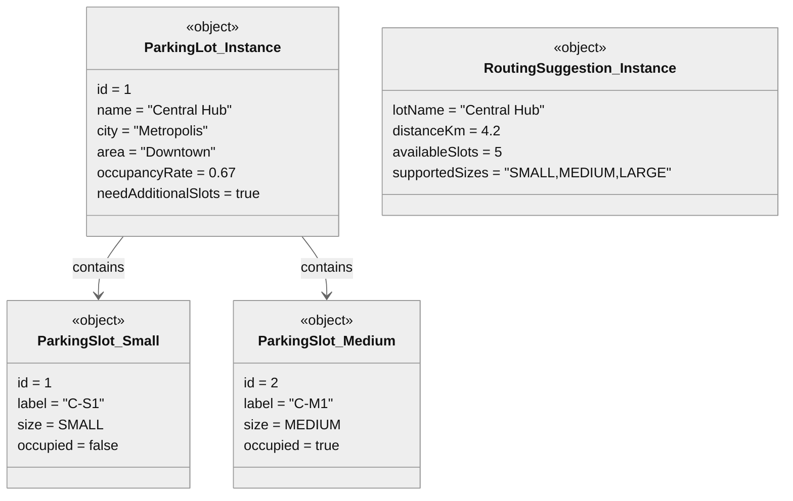

```mermaid
%%{init: {'theme': 'neutral'}}%%
classDiagram
  class ParkingLot_Instance <<object>> {
    id = 1
    name = "Central Hub"
    city = "Metropolis"
    area = "Downtown"
    occupancyRate = 0.67
    needAdditionalSlots = true
  }
  class ParkingSlot_Small <<object>> {
    id = 1
    label = "C-S1"
    size = SMALL
    occupied = false
  }
  class ParkingSlot_Medium <<object>> {
    id = 2
    label = "C-M1"
    size = MEDIUM
    occupied = true
  }
  class RoutingSuggestion_Instance <<object>> {
    lotName = "Central Hub"
    distanceKm = 4.2
    availableSlots = 5
    supportedSizes = "SMALL,MEDIUM,LARGE"
  }
  ParkingLot_Instance --> ParkingSlot_Small : contains
  ParkingLot_Instance --> ParkingSlot_Medium : contains
```
