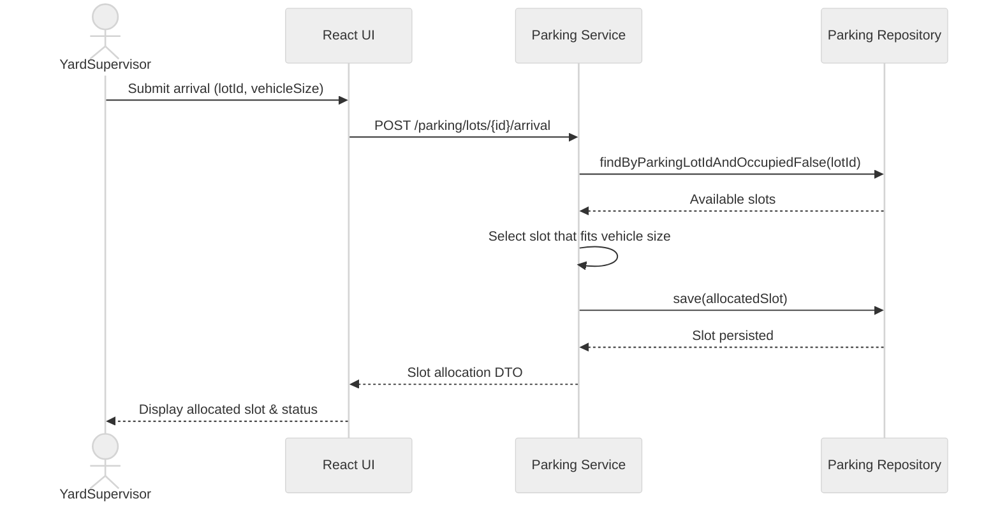

```mermaid
%%{init: {'theme': 'neutral'}}%%
sequenceDiagram
  actor YardSupervisor
  participant UI as React UI
  participant ParkingAPI as Parking Service
  participant ParkingRepo as Parking Repository

  YardSupervisor->>UI: Submit arrival (lotId, vehicleSize)
  UI->>ParkingAPI: POST /parking/lots/{id}/arrival
  ParkingAPI->>ParkingRepo: findByParkingLotIdAndOccupiedFalse(lotId)
  ParkingRepo-->>ParkingAPI: Available slots
  ParkingAPI->>ParkingAPI: Select slot that fits vehicle size
  ParkingAPI->>ParkingRepo: save(allocatedSlot)
  ParkingRepo-->>ParkingAPI: Slot persisted
  ParkingAPI-->>UI: Slot allocation DTO
  UI-->>YardSupervisor: Display allocated slot & status
```
