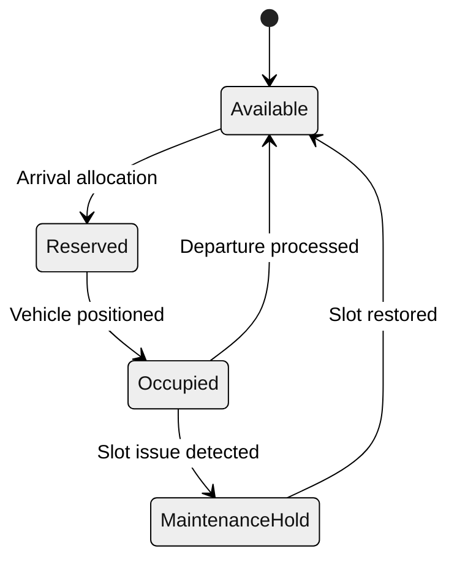

```mermaid
%%{init: {'theme': 'neutral'}}%%
stateDiagram-v2
  [*] --> Available
  Available --> Reserved: Arrival allocation
  Reserved --> Occupied: Vehicle positioned
  Occupied --> Available: Departure processed
  Occupied --> MaintenanceHold: Slot issue detected
  MaintenanceHold --> Available: Slot restored
```
