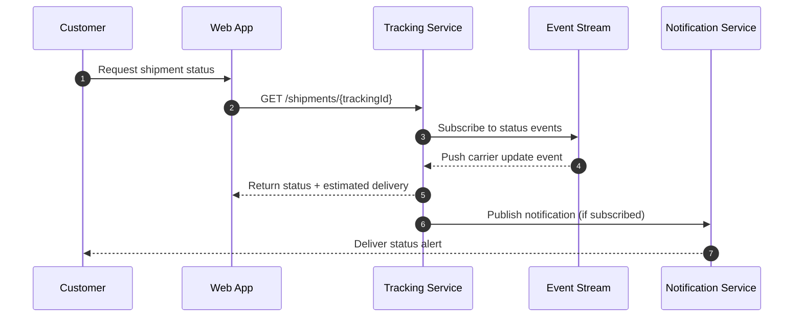
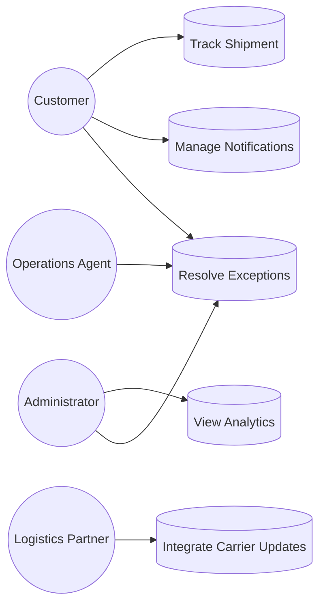
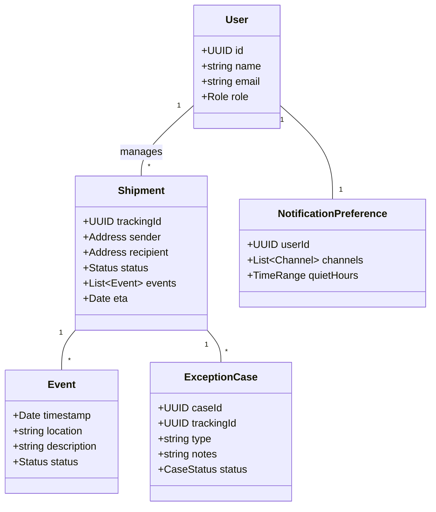
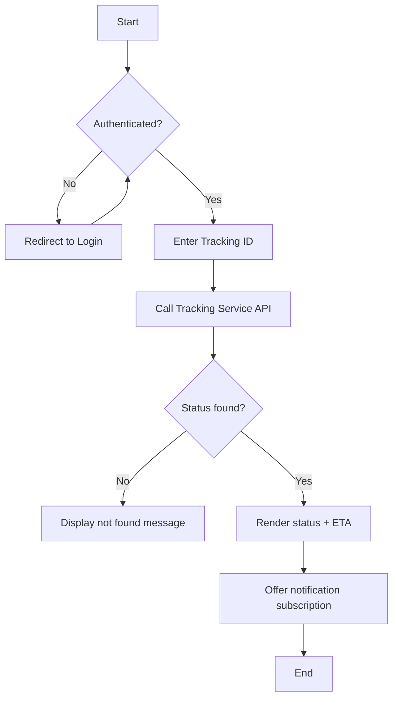
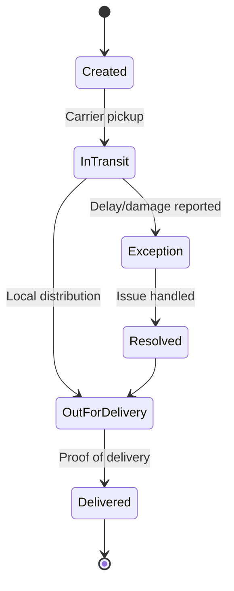
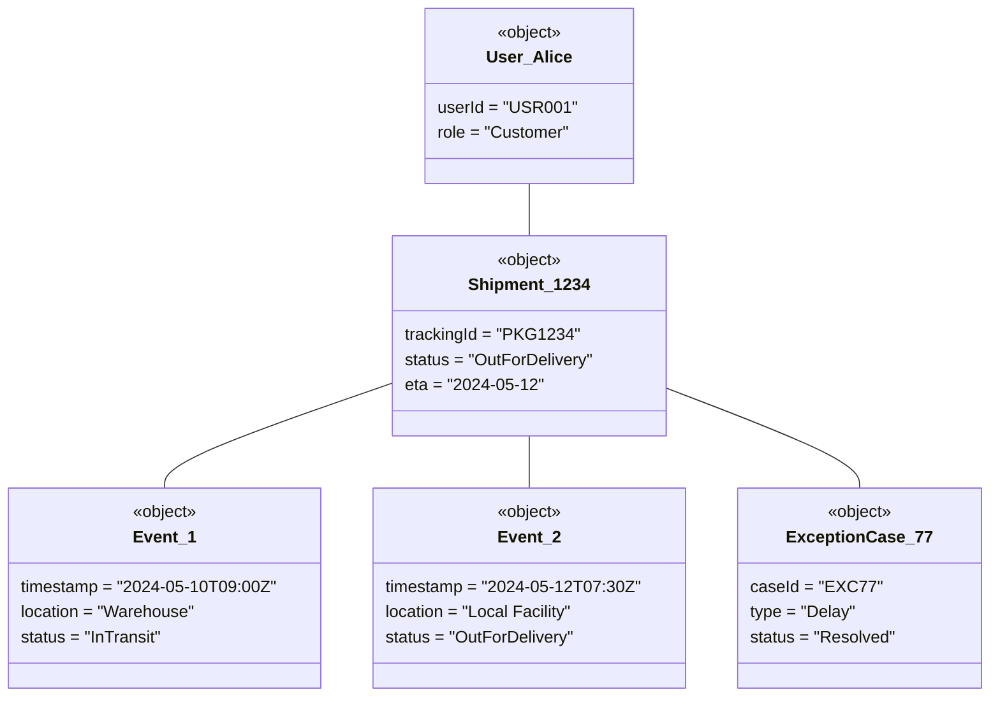
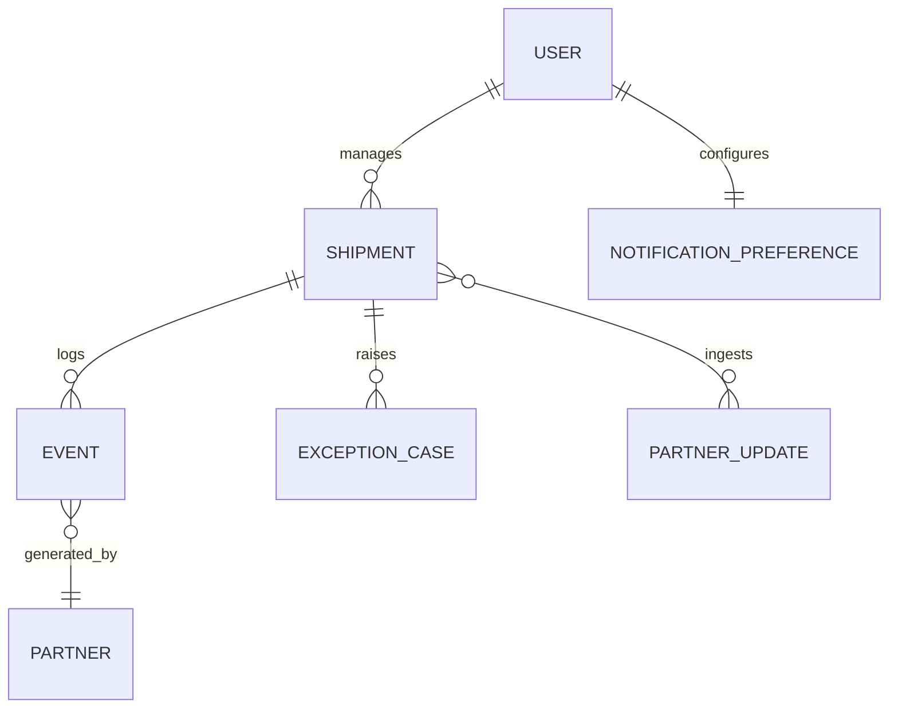

# Pracking Tracking System – Architecture & Design Artifacts

## Requirements Capturing

### Functional Requirements (FR)
| ID | Requirement | Rationale |
|----|-------------|-----------|
| FR-1 | Users shall register and authenticate to access personalized tracking dashboards. | Ensures secure access to tracking information. |
| FR-2 | Customers shall create, update, and archive shipment records. | Maintains comprehensive tracking information. |
| FR-3 | The system shall provide real-time status updates for each shipment. | Enables transparency and customer trust. |
| FR-4 | Users shall subscribe to notification preferences (email/SMS/push). | Supports proactive communication. |
| FR-5 | Operations staff shall manage exceptions (lost, delayed, damaged). | Supports issue resolution workflows. |
| FR-6 | The system shall expose APIs for third-party logistics partners. | Facilitates ecosystem integrations. |
| FR-7 | Administrators shall view analytics dashboards for performance KPIs. | Supports data-driven decision making. |

### Non-Functional Requirements (NFR)
| ID | Requirement | Target |
|----|-------------|--------|
| NFR-1 | Availability | 99.5% monthly uptime |
| NFR-2 | Performance | < 2 seconds average response time under 500 concurrent users |
| NFR-3 | Scalability | Horizontal scaling supported via container orchestration |
| NFR-4 | Security | Compliance with OWASP ASVS Level 2 and encrypted data at rest |
| NFR-5 | Observability | Centralized logging, distributed tracing, and metric dashboards |
| NFR-6 | Maintainability | Modular microservice architecture with automated CI/CD |
| NFR-7 | Privacy | GDPR-compliant consent and data retention policies |

## Actors
| Actor | Description |
|-------|-------------|
| Customer | Tracks shipments, manages notifications, and views history. |
| Operations Agent | Handles exceptions, resolves issues, and updates shipment metadata. |
| Logistics Partner | Pushes carrier status updates via partner APIs/webhooks. |
| Administrator | Configures services, monitors KPIs, and manages user roles. |
| Notification Provider | External gateway that delivers SMS/email/push alerts. |

## Sequence Diagram – Real-time Tracking Update


## Use-case Diagram


## Microservices Landscape
| Service | Responsibility | Identification Rationale |
|---------|----------------|--------------------------|
| Identity Service | Authentication, authorization, role management. | Security concerns are isolated and reusable across channels. |
| Tracking Service | Stores shipment data, aggregates carrier events, exposes tracking APIs. | Core domain logic benefiting from independent scaling. |
| Notification Service | Manages user preferences and dispatches alerts via providers. | High I/O workload suited for asynchronous processing. |
| Exception Management Service | Handles incident workflows, tasks, and audit logs. | Business-critical but distinct workflow requiring specialized persistence. |
| Analytics Service | ETL pipeline feeding dashboards and KPI reports. | Compute-intensive workloads decoupled from transactional systems. |
| Partner Integration Gateway | Normalizes carrier APIs/webhooks into internal event format. | Integrations change frequently; isolation reduces blast radius. |

## API Specification (Representative Endpoints)
| Method & Path | Description | Request Schema | Response Schema |
|---------------|-------------|----------------|-----------------|
| `POST /api/v1/auth/login` | Authenticate a user. | `{ "email": string, "password": string }` | `{ "token": string, "expiresIn": number }` |
| `GET /api/v1/shipments/{trackingId}` | Retrieve shipment status. | Path param `trackingId: string` | `{ "trackingId": string, "status": string, "eta": string, "events": Event[] }` |
| `POST /api/v1/shipments` | Create a new shipment record. | `{ "sender": Party, "recipient": Party, "route": Route }` | `{ "trackingId": string, "createdAt": string }` |
| `PATCH /api/v1/notifications/preferences` | Update notification preferences. | `{ "channels": string[], "quietHours": string }` | `{ "success": boolean }` |
| `POST /api/v1/exceptions` | Log a shipment exception. | `{ "trackingId": string, "type": string, "notes": string }` | `{ "exceptionId": string, "status": string }` |
| `GET /api/v1/analytics/kpi` | Fetch KPI snapshot. | Query params `from`, `to`. | `{ "onTimeRate": number, "avgDelivery": number }` |

## Class Diagram


## Flow Chart – Shipment Tracking Request


## State Diagram – Shipment Lifecycle


## Activity Diagram – Exception Handling Workflow
```mermaid
flowchart TD
    start((Start)) --> identify[Identify anomaly]
    identify --> log[Log exception case]
    log --> assign[Assign to operations agent]
    assign --> investigate[Investigate root cause]
    investigate --> decision{Carrier input required?}
    decision -- Yes --> requestInfo[Request carrier details]
    requestInfo --> updateCase[Update case with findings]
    decision -- No --> updateCase
    updateCase --> notify[Notify customer]
    notify --> close{Issue resolved?}
    close -- No --> investigate
    close -- Yes --> end((End))
```

## Object Diagram – Sample Runtime Instances


## ER Diagram


## Guiding Principles Applied
- **SOLID**: Services encapsulate single responsibilities (e.g., Tracking Service) and interfaces (APIs) favor dependency inversion via message queues and contracts.
- **KISS**: Adopted straightforward event-driven patterns and well-defined APIs to reduce complexity in distributed workflows.
- **YAGNI**: Deferred advanced routing optimizations and machine-learning predictions until driven by validated requirements.

## Prompt Used & Technique
- **Prompt**: "Design a microservices-based Package Tracking System and provide textual UML/mermaid diagrams for requirements, actors, sequence, use-case, APIs, and data models."
- **Technique**: Applied *Structured Prompting* by listing explicit artifacts needed, ensuring comprehensive coverage before content generation.
